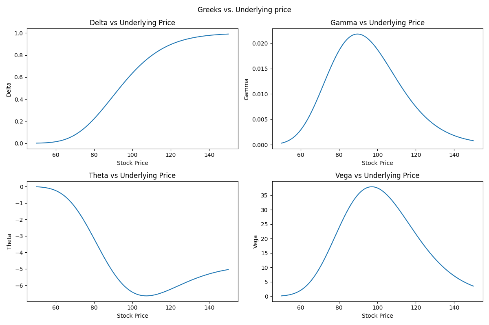
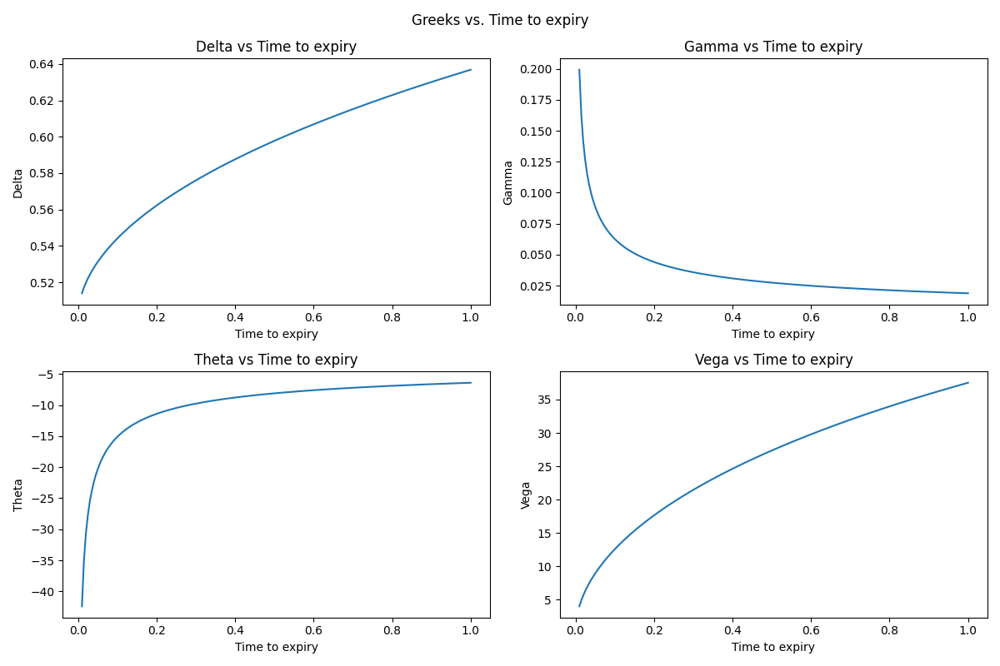
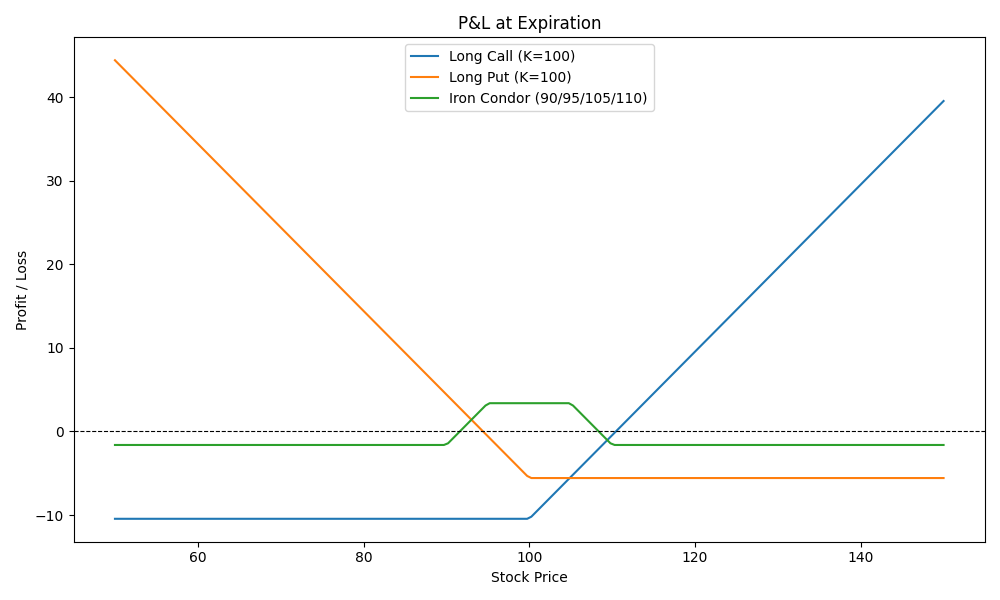
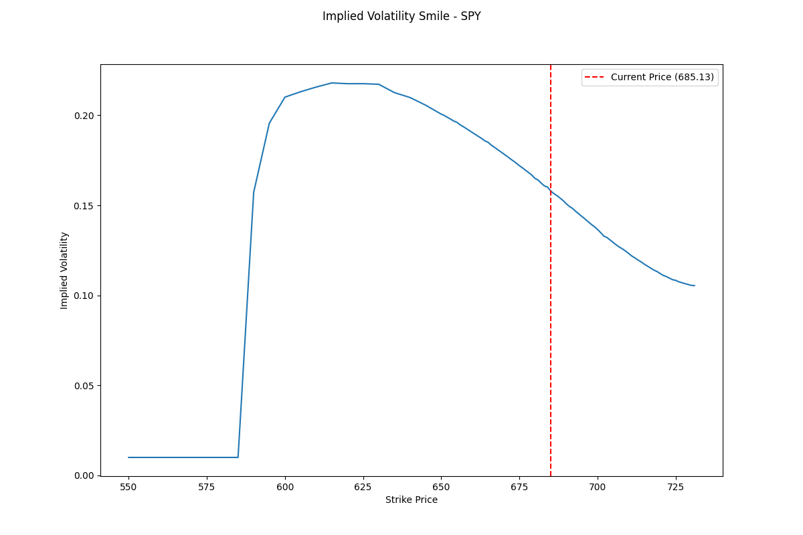
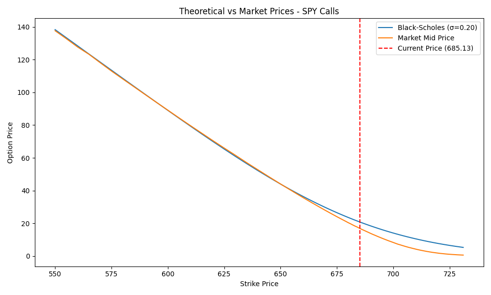

# Black Scholes Options Pricing Engine

A python implementation of the Black-Scholes pricing model with analytical Greeks computation, a Newton-Raphson implied volatility solver, and real market data comparison using live options chain data.

## Features

- **Closed-form pricing** for European calls and puts with put-call parity verification
- **Analytical Greeks** — Delta, Gamma, Theta, Vega, and Rho computed from first principles
- **Implied volatility solver** using Newton-Raphson with bisection fallback
- **Market data integration** — pulls live SPY options chains via yfinance and compares theoretical prices to market quotes
- **Visualizations** — Greeks sensitivity plots, P&L diagrams (including iron condor), and implied volatility smile

## The Math

The Black-Scholes model prices a European call option as:

$$C = SN(d_1) - Ke^{-rT}N(d_2)$$

where:

$$d_1 = \frac{\ln(S/K) + (r + \sigma^2/2)T}{\sigma\sqrt{T}}, \quad d_2 = d_1 - \sigma\sqrt{T}$$

The Greeks are partial derivatives of this pricing formula. For example, Delta measures price sensitivity to the underlying:

$$\Delta_{call} = N(d_1), \quad \Gamma = \frac{n(d_1)}{S\sigma\sqrt{T}}$$

Implied volatility is solved by inverting the pricing formula using Newton-Raphson iteration, where Vega serves as the derivative for the update step:

$$\sigma_{n+1} = \sigma_n - \frac{C_{BS}(\sigma_n) - C_{market}}{\nu(\sigma_n)}$$

## Visualizations

### Greeks vs. Underlying Price
Shows how each greek responds to changes in the stock price for an at the money option.



### Greeks vs. Time to Expiry
Demostrates the effext of expiration, especially on Gamma and Theta which spike near expiration for at the money options



### P&L at Expiration
Profit and Loss diagrams for a long call, a long put, and an iron condor (90, 95, 105, 110)



### Implied Volatility Smile
Implied volatility of live SPY options data using the Newton-Raphson solver. We see implied volatility is higher at lower strike prices (ignoring prices for which the solver could not provide a result). Something the black scholes model does not agree with as it assumes constant volatility which is not the case acoording to this



### Theoretical vs. Market Prices
Black-Scholes prices computed at a constant 20% volatility compared against actual market mid-prices. The divergence, particularly for out of the money options, shows the limitation of Black Scholes's constant volatility assumption



## How to Run

```bash
pip install -r requirements.txt

# Run the pricing engine with test parameters
python black_scholes.py

# Generate Greeks and P&L visualizations
python visualizer.py

# Pull live market data and generate IV smile
python market_comparison.py
```

## File Structure

```
├── images/                # Generated plots
├── black_scholes.py       # Core pricing engine, Greeks, IV solver
├── market_comparison.py   # Live market data comparison and IV smile 
├── requirements.txt       # Dependencies
├── visualiser.py          # Greeks and P&L visualisations
```